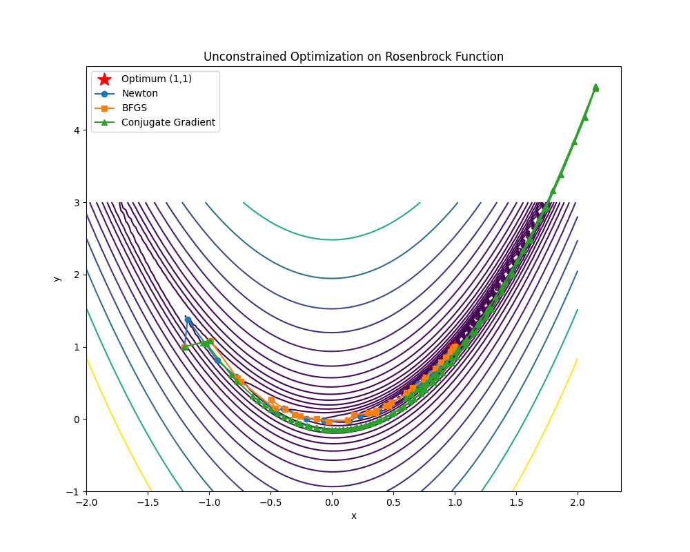
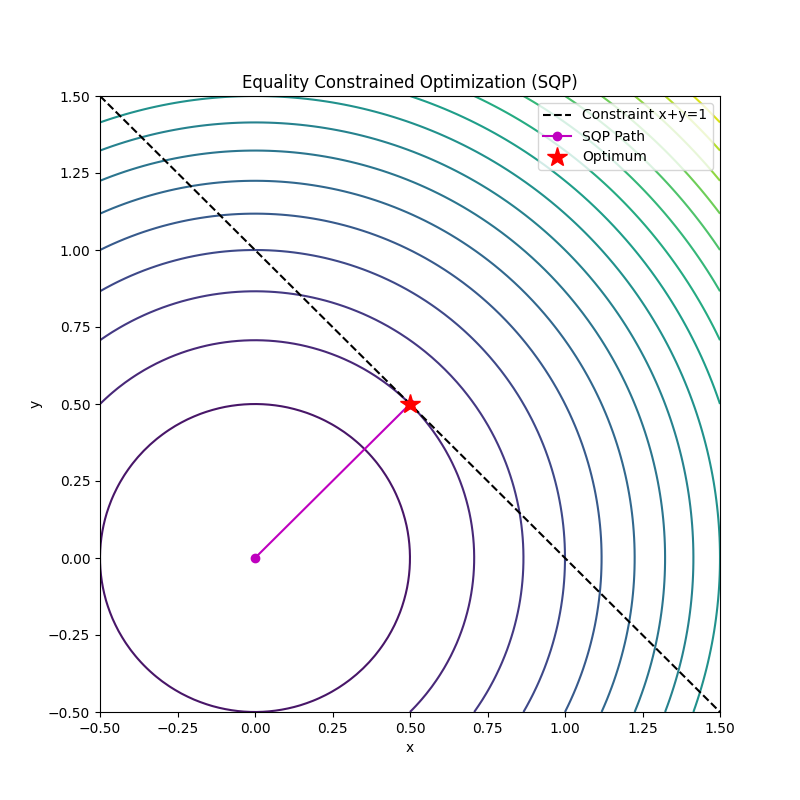

# karush : SF2822 Applied Nonlinear Optimization Library

**karush** is a Python library implementing key optimization algorithms covered in the KTH Royal Institute of Technology course **[SF2822 Applied Nonlinear Optimization](https://www.kth.se/student/kurser/kurs/SF2822)**.

This project provides clean, educational implementations of algorithms for unconstrained, constrained, semidefinite, and convex optimization problems.

### Course Content & Implementations

This library covers the following topics from the course syllabus:

*   **Unconstrained Optimization**:
    *   Newton's Method (`karush.unconstrained.newton`)
    *   Quasi-Newton Method (BFGS) (`karush.unconstrained.quasi_newton`)
    *   Nonlinear Conjugate Gradient (Fletcher-Reeves) (`karush.unconstrained.conjugate_gradient`)
*   **Constrained Optimization**:
    *   Quadratic Programming (Equality Constrained) (`karush.constrained.qp`)
    *   Sequential Quadratic Programming (SQP) (`karush.constrained.sqp`)
    *   Log-Barrier Method (`karush.constrained.barrier`)
    *   Primal-Dual Interior Point Method (`karush.constrained.primal_dual`)
*   **Semidefinite Programming**:
    *   Barrier Method for SDP (`karush.semidefinite.interior_point`)
*   **Convexity & Relaxations**:
    *   Semidefinite Relaxation for Max-Cut (`karush.convex.relaxations`)

### Installation

Clone the repository and install the dependencies:

```bash
git clone https://github.com/dhruvhaldar/karush.git
cd karush
pip install -r requirements.txt
```

### Usage Examples

#### Unconstrained Optimization (Rosenbrock Function)

```python
import numpy as np
from karush.unconstrained.newton import newton_method

def rosenbrock(x):
    return (1 - x[0])**2 + 100 * (x[1] - x[0]**2)**2

def rosenbrock_grad(x):
    g = np.zeros_like(x)
    g[0] = -2 * (1 - x[0]) - 400 * x[0] * (x[1] - x[0]**2)
    g[1] = 200 * (x[1] - x[0]**2)
    return g

def rosenbrock_hess(x):
    H = np.zeros((2, 2))
    H[0, 0] = 2 - 400 * x[1] + 1200 * x[0]**2
    H[0, 1] = -400 * x[0]
    H[1, 0] = -400 * x[0]
    H[1, 1] = 200
    return H

x0 = [-1.2, 1.0]
x_opt, path = newton_method(rosenbrock, rosenbrock_grad, rosenbrock_hess, x0)
print(f"Optimal solution: {x_opt}")
```

#### Constrained Optimization (SQP)

```python
from karush.constrained.sqp import sqp_equality_constrained

# Minimize x^2 + y^2 s.t. x + y = 1
def f(x): return x[0]**2 + x[1]**2
def grad_f(x): return np.array([2*x[0], 2*x[1]])
def hess_f(x): return np.array([[2, 0], [0, 2]])
def h(x): return np.array([x[0] + x[1] - 1])
def grad_h(x): return np.array([1, 1])

x0 = [0.0, 0.0]
x_opt, path = sqp_equality_constrained(f, grad_f, hess_f, h, grad_h, x0)
print(f"Optimal solution: {x_opt}")
```

### Visualizations

The library includes scripts to visualize the optimization path of different algorithms.

#### Unconstrained Optimization on Rosenbrock Function
Comparison of Newton's Method, BFGS, and Conjugate Gradient.



#### Equality Constrained Optimization
SQP method solving $\min x^2 + y^2$ subject to $x+y=1$.



### License

MIT License
